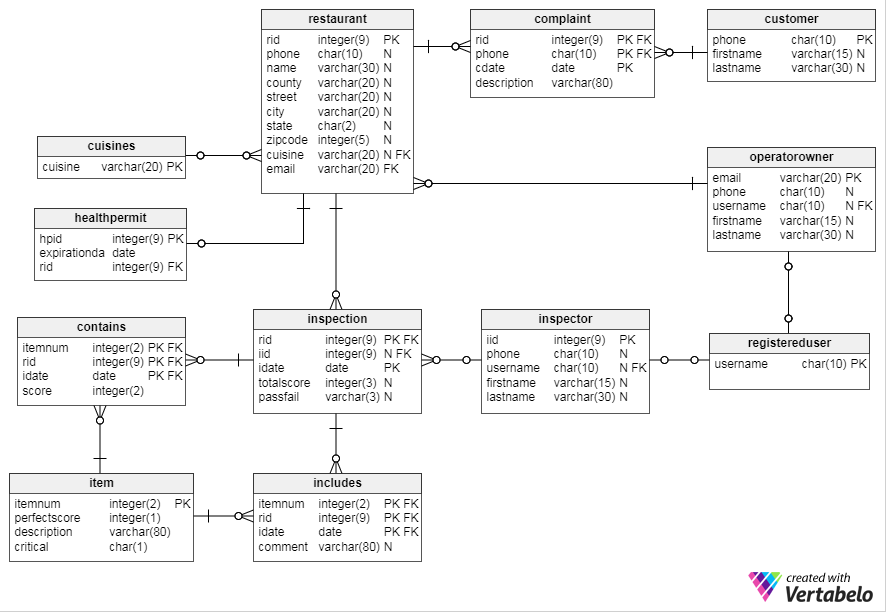

# Restaurant Quality Control
This repository showcases some of the work done in back-end development for a restaurant quality management project. MySQL was used as the relational database.

## Files

* Table creation

Tables were designed for the entities. The file `script0-create-tables.sql` contains the create table statements that define the schema.

The user entities are *customer*, *operator owner* and *inspector*. Correspondingly, tables

 `registereduser, customer, inspector, operatorowner`
 
 were created. Other entities in the domain include
 
 `restaurant, cuisines, healthpermit, inspection, complaint,` and `item`.
 

* SQL queries

SQL queries were constructed for each application-level operation. Each application task is described in a text file, and the corresponding sql statements are written in an sql file, e.g. fig2b.txt and sql_fig2b.sql.

>For example:
>
>A user may want to search for a restaurant based on the conjunction of health inspection score, zipcode, restaurant name, and cuisine. The user is then displayed a list of restaurants. Each of these restaurants has a score less than / greater than the user specified score, and a name, zipcode and cuisine that matches the user entered values respectively. The user is displayed a list of restaurant names, addresses, cuisines, last inspection score, and date of last inspection.
>
>The SQL to produce this information from the data is listed in fig2b.txt

## Application Description

There are primarily three types of users. The application flow is determined by the type of user logged in. The users are guest/customer, restaurant operator/owner, and inspector.

Each user is guided through a different flow.

1. [Guest / Customer](customerUser.md)

Guest user has two general options: searching for restaurants and filing a complaint.

2. Restaurant Operator / Owner

A restaurant operator can choose from: inserting information about their restaurant and querying/displaying health inspection report results for the last two inspections.

3. Health Inspector

A health inpector can choose from: inserting a restaurant inspection report and displaying 4 summary reports.

More information on the application can be found in the design-info.pdf file.

## Languages

